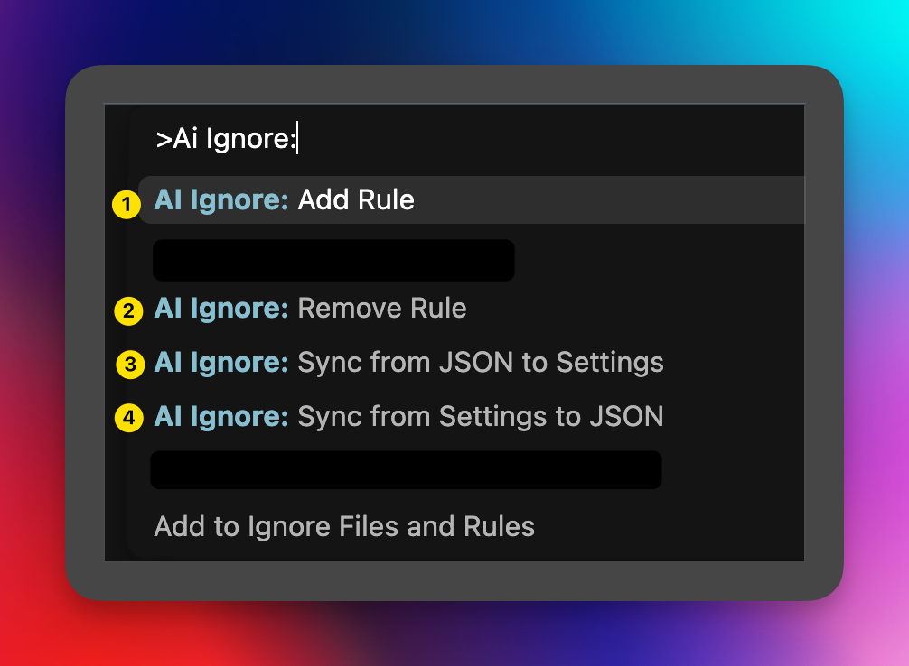

# AI Ignore Helper


[](https://github.com/usblsb)

Una extensión configurable para Visual Studio Code que permite añadir archivos y carpetas a múltiples tipos de archivos `.ignore` de forma rápida y sencilla.

---

## Tabla de Contenidos

- ✨ Características Principales
- 🚀 Instalación
- 💻 Uso
- ⚙️ Configuración
- 🛠️ Tecnologías Utilizadas
- 🤝 Cómo Contribuir
- 👤 Autor
- 📄 Licencia

---

## ✨ Características Principales

- **Añadir a múltiples archivos ignore:** Permite agregar una carpeta o archivo a varios archivos `.ignore` (como `.dockerignore`, `.npmignore`, `.trae/.ignore`, `.geminiignore`, etc.) de una sola vez.
- **Menú contextual:** Se integra con el menú del explorador de archivos de VS Code (clic derecho sobre un archivo o carpeta).
- **Selección múltiple de archivos:** Soporta correctamente la selección múltiple de archivos desde el explorador, procesando todos los archivos seleccionados en una sola operación.
- **Altamente configurable:** Los usuarios pueden definir sus propios archivos `ignore` a través de un archivo `JSON` de configuración global.
- **Creación automática:** Puede crear los archivos `ignore` y sus directorios si no existen.
- **Selección de archivos ignore:** Permite elegir a qué archivos `ignore` específicos se quiere añadir la ruta.

## 🚀 Instalación

### Instalación desde VSIX (Recomendado)

1.  Descarga el archivo `ai-ignore-helper-3.0.4.vsix` desde el repositorio.
2.  Abre **Visual Studio Code**.
3.  Ve a la vista de **Extensiones** (puedes usar el atajo `Ctrl+Shift+X`).
4.  Haz clic en el menú de tres puntos (...) y selecciona **"Install from VSIX..."**.
5.  Selecciona el archivo `.vsix` descargado.

### Instalación desde Marketplace (Futuro)

1.  Abre **Visual Studio Code**.
2.  Ve a la vista de **Extensiones** (puedes usar el atajo `Ctrl+Shift+X`).
3.  Busca `AI Ignore Helper`.
4.  Haz clic en **Instalar**.

## 💻 Uso

### Activación Inicial

1.  Una vez instalada, la extensión se activa automáticamente al abrir VS Code.
2.  No se crean carpetas ni archivos en tu proyecto de forma automática, manteniendo tu workspace limpio.

### Añadir Archivos Individuales

1.  Haz clic derecho sobre un archivo o carpeta en el explorador de archivos.
2.  Selecciona la opción **"Add to Ignore Files and Rules"** en el menú contextual.
3.  Se mostrará una lista con los archivos `ignore` que tienes configurados. Selecciona a cuál o cuáles quieres añadir la ruta.
4.  ¡Listo! La ruta se añadirá automáticamente a los archivos seleccionados.

### Añadir Múltiples Archivos

1.  **Selecciona múltiples archivos** en el explorador manteniendo `Ctrl` (o `Cmd` en Mac) mientras haces clic en cada archivo.
2.  Haz clic derecho sobre cualquiera de los archivos seleccionados.
3.  Selecciona **"Add to Ignore Files and Rules"** en el menú contextual.
4.  La extensión procesará automáticamente **todos los archivos seleccionados** y los añadirá a los archivos ignore elegidos.

### Comandos Disponibles

- `Activate AI Ignore Helper`: Verifica y asegura que los archivos ignore habilitados existan.
- `AI Ignore: Add Rule`: Añade una nueva regla al listado global.
- `AI Ignore: Remove Rule`: Elimina una regla existente del listado global.
- `Open AI Ignore Helper Configuration`: Abre el archivo de configuración global (almacenado en el Global Storage de VS Code).
- `AI Ignore: Sync from JSON to Settings`: Sincroniza la configuración desde el archivo JSON global a VS Code Settings.
- `AI Ignore: Sync from Settings to JSON`: Sincroniza la configuración desde VS Code Settings al archivo JSON global.

## ⚙️ Configuración

La extensión utiliza un sistema de almacenamiento global para evitar ensuciar tus proyectos con archivos de configuración locales.

### 1. Configuración desde VS Code Settings (Recomendado)

1. Abre VS Code Settings (`Ctrl+,` o `Cmd+,`)
2. Busca "AI Ignore" en la barra de búsqueda
3. Configura los archivos ignore y comportamientos desde la interfaz gráfica. Los cambios se aplicarán de forma global.

### 2. Configuración desde archivo JSON global

Puedes editar directamente el archivo de configuración JSON que se almacena en el directorio de datos de la extensión (Global Storage). Esto permite compartir tus plantillas de ignore entre todos tus proyectos sin crear archivos en cada uno de ellos.

Para abrirlo, usa el comando: `Open AI Ignore Helper Configuration`.

---

## 🔧 Notas Técnicas

### Limpieza de Workspace (Zero Pollution)

A partir de la versión 3.0.3 y perfeccionado en **3.0.4**, la extensión sigue una filosofía de **cero polución**:
- **Sin carpeta `.vscode/` automática**: No se fuerza la creación de `settings.json` en el workspace.
- **Sin carpeta `config/`**: El archivo `ignore-files-config.json` se almacena fuera del workspace del usuario.
- **Configuración Global**: Las reglas y preferencias se mantienen a nivel de usuario, permitiendo que `git clone` funcione siempre en directorios limpios.

### Sincronización Inteligente

La extensión mantiene una sincronización bidireccional entre los VS Code Settings (User scope) y un archivo JSON de respaldo en el almacenamiento global. Esto garantiza que tus reglas estén siempre disponibles y sean fáciles de editar masivamente si lo deseas.

### Historial de Versiones

**v3.0.4**

- **Zero Pollution Completo**: Eliminación total de dependencias de archivos locales para configuración.
- **Limpieza**: Código refactorizado para usar exclusivamente almacenamiento global.

**v3.0.3**

- **Refactorización de Almacenamiento**: Eliminada la creación automática de carpetas `.vscode/` y `config/` en el workspace.
- **Uso de GlobalStorageUri**: La configuración ahora se almacena en el directorio de datos global de VS Code.
- **Zero Pollution**: La extensión ya no ensucia el workspace al iniciarse, permitiendo directorios de trabajo limpios.

**v3.0.2**

- Añadido archivo por defecto `Gemini Ignore` (`.geminiignore`) a la configuración.

**v3.0.1**

- Añadido archivo por defecto `Vercel Ignore` (`.vercelignore`) a la configuración y ejemplo del README

**v2.0.8**

- **Menú contextual**: Cambiado a "Add to Ignore Files and Rules".
- **Nuevos comandos**: `AI Ignore: Add Rule` y `AI Ignore: Remove Rule` para gestionar reglas sin editar archivos.
- **Sincronización automática**: Watcher de `config/ignore-files-config.json` que sincroniza JSON → Settings al guardar.
- **Uso inmediato**: Al añadir o eliminar reglas, aparecen/desaparecen del menú sin reempaquetar ni recargar.

### Tecnologías Utilizadas

- **JavaScript**
- **Node.js**
- **Visual Studio Code API**

## 🤝 Cómo Contribuir

¡Las contribuciones son bienvenidas! Si quieres mejorar este proyecto, por favor sigue estos pasos:

1.  Haz un **Fork** de este repositorio.
2.  Crea una nueva rama (`git checkout -b feature/nueva-caracteristica`).
3.  Realiza tus cambios y haz **Commit** (`git commit -m 'Añade una nueva característica'`).
4.  Haz **Push** a tu rama (`git push origin feature/nueva-caracteristica`).
5.  Abre un **Pull Request**.

## 📸 Capturas

Puedes incluir capturas en este README añadiendo imágenes a la carpeta `images/` y referenciándolas con rutas relativas, por ejemplo:

```md

```

Captura de la paleta de comandos con numeración de botones:



## 👤 Autor

- **Juan Luis Martel Revuelta** - [@usblsb](https://github.com/usblsb) · Web: https://usblsb.com

## 📄 Licencia

Este proyecto está bajo la Licencia MIT. Consulta el archivo `LICENSE.md` para más detalles.